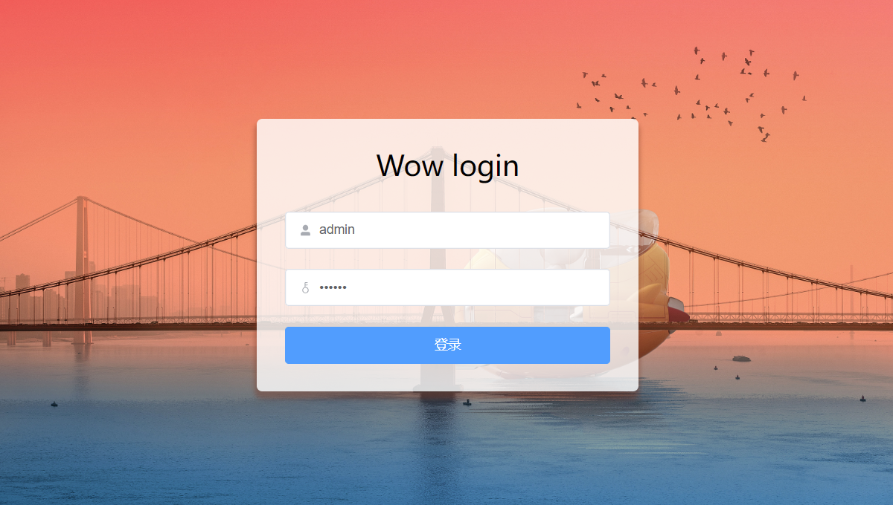
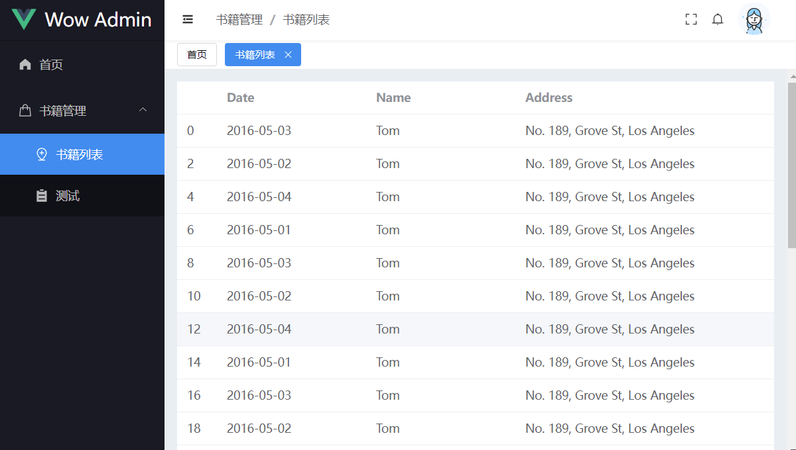

# wow-app
基于 Vite + Vue3 + Pinia + Element Plus的后台管理系统模板

## support
- Vue3
- JSX
- Vite3
- Pinia
- Typescript
- SCSS
- Element Plus
- Axios
- 集成 Eslint + Stylelint + Prettier 来规范和格式化代码
- 集成 Mock 辅助开发

## usage

```bash
git clone https://github.com/ueumd/wow-admin-vue.git

pnpm i
pnpm dev
```

## Git 贡献提交规范
- 参考 [vue](https://github.com/vuejs/vue/blob/dev/.github/COMMIT_CONVENTION.md) 规范 ([Angular](https://github.com/conventional-changelog/conventional-changelog/tree/master/packages/conventional-changelog-angular))
    - `feat` 增加新功能
    - `fix` 修复问题/BUG
    - `style` 代码风格相关无影响运行结果的
    - `perf` 优化/性能提升
    - `refactor` 重构
    - `revert` 撤销修改
    - `test` 测试相关
    - `docs` 文档/注释
    - `chore` 依赖更新/脚手架配置修改等
    - `workflow` 工作流改进
    - `ci` 持续集成
    - `types` 类型定义文件更改
    - `wip` 开发中
    - `mod` 不确定分类的修改
    - `release` 发布

<p>
  
  
</p>

