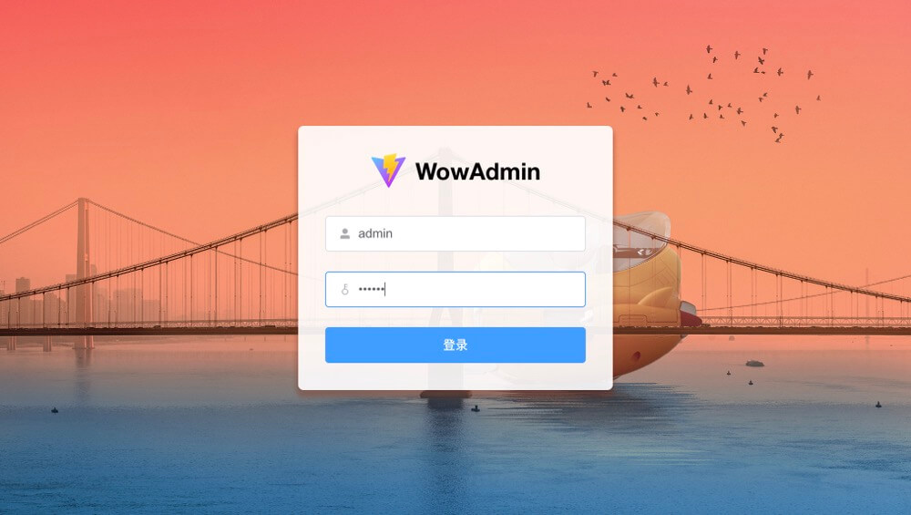
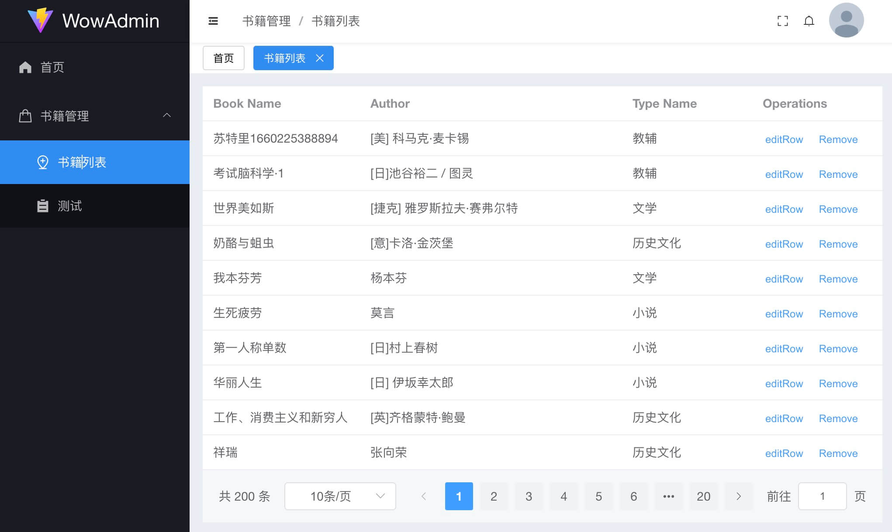

# wow-app
基于 Vite + Vue3 + Pinia + Element Plus的后台管理系统模板

## support
- Vue 3
- Vue Router
- Pinia
- Typescript
- Vite 3
- SCSS
- Element Plus
- Axios
- 支持JSX
- 集成 Eslint + Stylelint + Prettier 来规范和格式化代码
- 集成 Mock 辅助开发

## usage

```bash
git clone https://github.com/ueumd/wow-admin-vue.git

## dev
pnpm i
pnpm dev

## prod
pnpm run build
cd dist
http-server
```

<p>
  
  
</p>

## Related items
- React版本：[wow-admin-react](https://github.com/ueumd/wow-admin-react.git)
